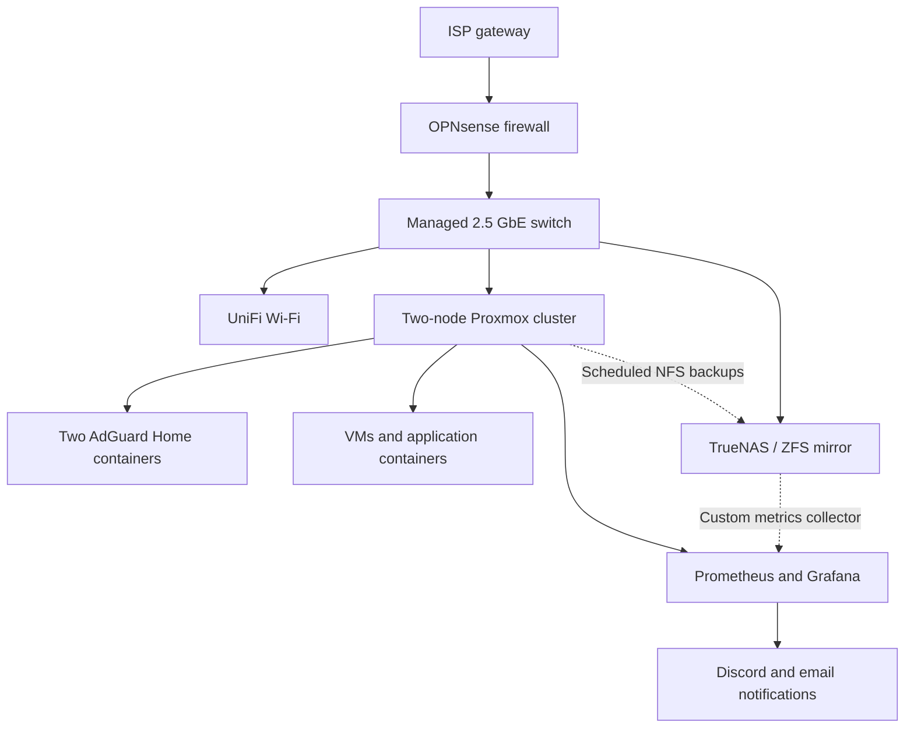

# Home Lab Infrastructure

**Network segmentation · Virtualization · Storage · DNS · Observability**

## Overview

This repository documents the design, implementation, and administration of my home lab. I built the environment to develop practical experience with networking, Linux systems, virtualization, storage, and infrastructure operations beyond my day-to-day IT support responsibilities.

The lab includes an OPNsense firewall, managed 2.5 GbE networking, a two-node Proxmox VE cluster, TrueNAS storage, redundant AdGuard Home DNS resolvers, and centralized monitoring through Prometheus and Grafana. Documentation focuses on the decisions behind the configuration, how I validated it, and the problems encountered during implementation.

**Project status:** Active home lab. Core networking, compute, storage, DNS, dashboards, and alerting are operational. This is **not** presented as a production high-availability deployment.

## Architecture

*Logical diagram. Physical port assignments, addresses, credentials, and management access paths are intentionally omitted. The ISP gateway is currently upstream of OPNsense; bridge mode is planned but not yet implemented.*

See [Architecture](docs/architecture.md) for component roles and data flows.

## Implemented systems

| Area | Implementation | Engineering focus |
| --- | --- | --- |
| Routing and security | OPNsense; seven VLANs including management and work isolation | Firewall policy, routing, inter-VLAN access control |
| Switching and wireless | Managed 2.5 GbE switch; UniFi access point | 802.1Q trunk/access configuration, SSID segmentation |
| Compute | Two Proxmox VE mini-PC nodes | VM/LXC lifecycle, host troubleshooting, cluster management |
| Storage | TrueNAS with a two-disk, 14 TB-per-drive ZFS mirror | NFS, SMB, pool health, backup target management |
| DNS | Two AdGuard Home instances on separate compute nodes | Local DNS, filtering, resolver redundancy and testing |
| Applications | Debian VM with Docker-managed services | Service isolation and storage/network dependencies |
| Monitoring | Prometheus, Grafana, custom metrics collectors | Dashboards, PromQL, data quality, incident notifications |

## Validation and results

- Verified network segmentation through client addressing and permitted/blocked connection tests, including separate wireless networks.
- Configured nightly Proxmox snapshot backups to TrueNAS for **five production guests**; checked job results, archive reporting, and backup telemetry. **An isolated restore drill is still outstanding.**
- Built a full Grafana command dashboard and a compact layout validated at **1280 × 720** for a planned rack-mounted display.
- Configured **14 Grafana-managed alert rules** covering Proxmox, DNS, backup health, and ZFS. All 14 showed **Normal** in the October 9, 2026 audit.
- Tested a temporary alert through **Firing → Resolved** and confirmed delivery through both Discord and email.
- Investigated and corrected an alert expression that generated a false firing series despite healthy ZFS capacity.

The validation record distinguishes observed results from assumptions and future work: [Validation](docs/validation.md).

## Documentation

| Document | Contents |
| --- | --- |
| [Architecture](docs/architecture.md) | Component roles, logical boundaries, monitoring and backup data flows |
| [Networking](docs/networking.md) | VLAN design, firewall policy, isolation testing |
| [Virtualization and storage](docs/virtualization-storage.md) | Proxmox, ZFS, NFS backups, operational limits |
| [DNS and services](docs/dns-services.md) | Dual AdGuard configuration and application placement |
| [Monitoring and alerting](docs/monitoring.md) | Data collection, dashboard design, alert inventory and PromQL lessons |
| [Incident reports](docs/incident-reports.md) | Diagnostic steps, remediation, verification and lessons learned |
| [Validation](docs/validation.md) | Evidence and remaining test coverage |
| [Roadmap](docs/roadmap.md) | Pending infrastructure changes and known limitations |
| [PromQL examples](examples/alert-queries.promql) | Sanitized examples adapted from monitoring rules |

## Scope and limitations

The cluster uses two nodes and does not imply automatic failover or independently verified high availability. A ZFS mirror improves tolerance of a single-drive failure but is not a substitute for backups. Backup jobs have completed, but restore testing remains a separate requirement. An external heartbeat for the monitoring host has not yet been deployed.

The repository contains selected architecture notes and sanitized examples. Live configuration exports, internal addressing, authentication material, and recovery procedures remain in private operational documentation.

*Implementation snapshot: October 2026. Infrastructure changes and further validation will be documented as the lab develops.*
