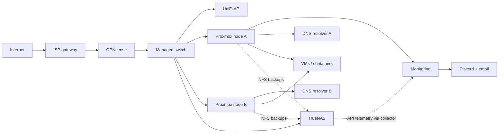

# Infrastructure Architecture

## System design

The lab separates routing, compute, and storage responsibilities across dedicated hosts. OPNsense handles firewall and VLAN routing; Proxmox hosts virtualized services; TrueNAS provides persistent shared storage and an NFS backup destination. A managed switch carries the VLANs between network devices.

The ISP gateway remains in routing mode upstream of OPNsense at this checkpoint. Bridge mode is a planned change, not a completed design feature.

## Logical topology

The diagram represents roles, not individual VLAN tags or every physical connection. DNS placement reflects the distributed resolver design, but guest placement can change as workloads migrate.

## Responsibilities and failure domains

| Component | Responsibility | Important dependency or limit |
| --- | --- | --- |
| OPNsense | Routing, DHCP coordination, firewall and inter-VLAN policy | Network-edge failure affects multiple zones |
| Managed switch | 2.5 GbE access and tagged traffic | Shared switching remains a potential single point of failure |
| Proxmox nodes | Run LXCs and VMs | Two-node quorum must be considered; cluster membership does not imply HA |
| TrueNAS | SMB storage, ZFS mirror, NFS backup target | One NAS appliance; mirror cannot address host-wide failure |
| AdGuard instances | Filter and resolve client DNS queries | Two DNS instances improve availability, but clients differ in resolver behavior |
| Monitoring container | Prometheus, Grafana and alert evaluation | Failure of the monitoring host can prevent notifications |

## Traffic and telemetry flows

1. **Client traffic:** Trusted, server, IoT, guest, lab, work, and management networks cross the firewall only where policy permits. The wireless access point maps relevant SSIDs onto VLANs.
2. **Service resolution:** AdGuard provides recursive/filtering service for clients; internal DNS queries are resolved through the designated local DNS path.
3. **Backups:** A scheduled Proxmox job writes selected guest backups to TrueNAS over NFS. Backups are not the same as a tested restore.
4. **Monitoring:** Prometheus scrapes exporters. Custom collectors expose data about external systems through Node Exporter metrics, including TrueNAS health and Proxmox backup status. Grafana evaluates alert rules and delivers notifications through configured contact points.

## Design decisions

- Dedicated firewall and NAS roles reduce coupling between infrastructure services and virtualized applications.
- VLAN separation makes firewall policies explicit and testable instead of relying on all devices sharing one broadcast domain.
- A compact two-node cluster balances cost and learning goals against power, memory and quorum limitations.
- Observability includes data freshness checks; a successful exporter scrape alone does not prove its source data is current.

The detailed live topology, host addressing, switch port map, and administrative procedures are maintained separately from this public document.
